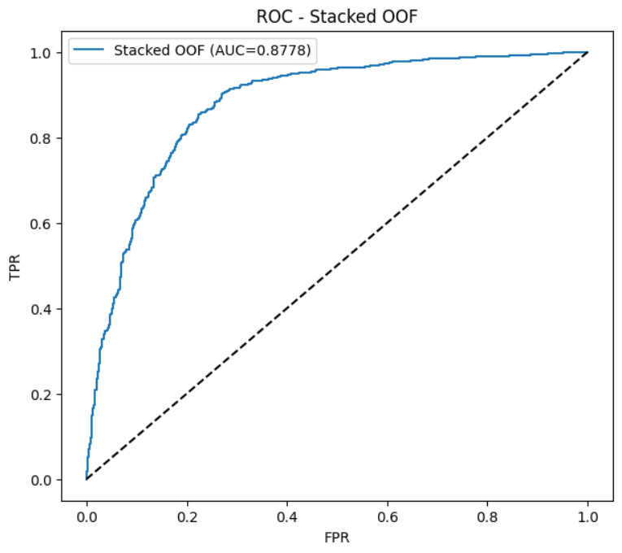
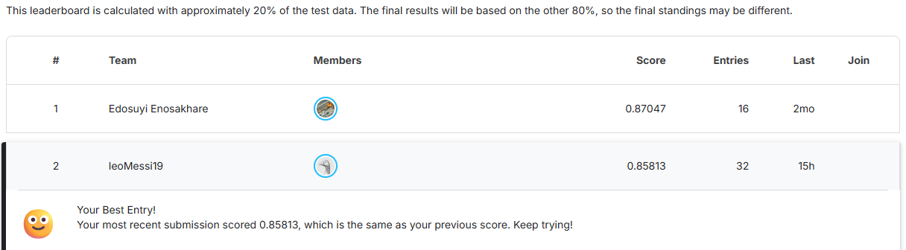

# 🌧️ Rainfall Prediction with Stacked Models

This project was developed for the **Kaggle Rainfall Prediction Competition**.  
A **stacking ensemble** of LightGBM, XGBoost, and Random Forest with a Logistic Regression meta-model was implemented to achieve high performance.  

📌 Currently ranked **2nd place 🥈** on the leaderboard 🚀  

---

## 🚀 Features
- ✅ **Feature Engineering**: outlier clipping, feature removal, interaction features
- ✅ **Base models**: LightGBM, XGBoost, Random Forest
- ✅ **Stacking approach** with Logistic Regression meta-model
- ✅ **Cross Validation with OOF predictions** for reliable evaluation
- ✅ ROC AUC and ROC Curve for performance analysis
- ✅ Automatic Kaggle-ready `submission.csv` generation

---

## 📊 Dataset
- **train.csv**: Training data
- **test.csv**: Kaggle test set  
- Target variable: `rainfall` (0 = no rain, 1 = rain)

Feature engineering highlights:
- Dropped less useful variables (`mintemp`, `maxtemp`, `temparature`, `winddirection`)
- Kept more predictive features (`pressure`, `dewpoint`, `humidity`, `cloud`, `sunshine`, `windspeed`)

---

## ⚙️ Tech Stack
- Python 3.10
- Pandas, NumPy
- Scikit-learn
- LightGBM
- XGBoost
- Matplotlib, Seaborn

---

## 📈 Model Performance

- **Base Models AUC:**
  - LightGBM: ~0.86
  - XGBoost: ~0.85
  - RandomForest: ~0.83
- **Stacked Meta Model AUC:** ~0.88 🎯

ROC Curve:  


---

## 🏆 Kaggle Leaderboard
My submission result:  


---

## 🔧 Usage

```bash
# 1) Create an enviroment
python -m venv venv

# 2) Install dependencies
pip install -r requirements.txt

# 3) Place dataset files in the root directory
train.csv
test.csv

# 4) Run the training & inference script
python main.py

# 5) Get Kaggle-ready submission file
submission.csv
